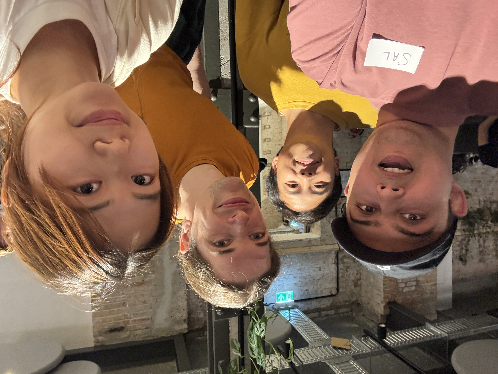

# cursor-hackathon

**Judge report:** [`JUDGE-REPORT.md`](./JUDGE-REPORT.md) — how we used Cursor, Grok Bot, agents, and merged four humans’ ideas.

Taxfix Cursor Hackathon Berlin — **Tax Pulse** weekly tax-save pulse.

See `TEAM-PLAN/` for shared truth (lanes, demo, score).

## Demo path (2 minutes)

1. Open `/` (index is the pulse).
2. Add this week’s expense (try `coworking day pass` + `45`).
3. Instant readout: deductible? why? **€ save this week / YTD**.
4. Tax Pulse + filing confidence grows.
5. Return reason: open next week to see the score — no nags.

Counter scaffold remains at `/counter`.

## How to run

```bash
pnpm install
pnpm dev
```

Node `>=24 <25`. Agents must not start `pnpm run dev` if Sal already has it.

## Pitch VIDEO

Follow `TEAM-PLAN/DEMO.md`. Upload by **21:00** Berlin. Sal owns upload + present.

## Agent trail

See [`HOW-WE-BUILT.md`](./HOW-WE-BUILT.md) and `TEAM-PLAN/HOW-WE-BUILT.md`.

## Presentation recording

[Watch or download the presentation recording (MOV, 2 min 10 sec)](./public/presentation/pitch-recording.mov)

## Our team


